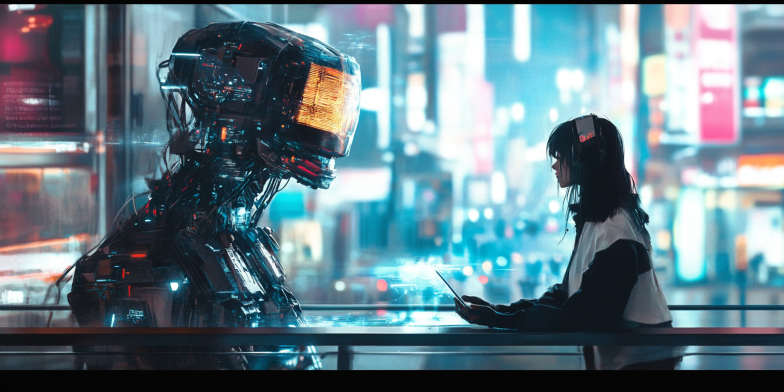

# AI and its Revolution in the Workplace

Since the world met ChatGPT, many things have changed, and yet, we are just beginning.

ChatGPT marked the beginning of a new era, the era of generative AI, an era where creativity can be favored with a world of applications to generate text, audio, videos, and images thanks to generative AI.

Similarly, there are many jobs that benefit from this technology: Copywriting, Programming, and Customer Service are just a few examples.

And there are many concerns about what will happen in the future with AI. Will our jobs be replaced by an AI agent or a robot? Or will we coexist?

Let's learn a little about AI today.

## What is AI?

The term "Artificial Intelligence" was first coined in 1956 at the Dartmouth Conference.

Initially, AI was described as the ability of machines to mimic human reasoning. Now, it's seen as a broader field involving machine learning, data processing, and automation to perform tasks that typically require human intelligence.

So, what is AI, and what is the difference between traditional AI and Generative AI?

Traditional AI refers to systems that follow a set of predefined rules to perform specific tasks, often relying on structured data. In contrast, Generative AI uses advanced algorithms, such as deep learning, to create new content by learning patterns from existing data. This allows Generative AI to produce creative outputs, such as text, images, or music, that are original and not merely repetitions of input data.

## AI in Everyday Life

AI is already a part of our daily lives in various forms:

- **Smartphones:** AI powers voice assistants like Siri and Google Assistant.
- **Smart Home Devices:** AI enables smart thermostats, security systems, and home automation.
- **Online Services:** AI is used in recommendation systems for streaming services, e-commerce, and social media.

## History of AI

Artificial Intelligence (AI) has a rich history that dates back to the mid-20th century. Here are some significant milestones:

- **1956:** The Dartmouth Conference, where the term "Artificial Intelligence" was coined.
- **1960s:** Development of the first neural networks and early AI programs like ELIZA.
- **1980s:** The rise of expert systems and the AI winter due to unmet expectations.
- **1997:** IBM's Deep Blue defeats world chess champion Garry Kasparov.
- **2010s:** The advent of deep learning and breakthroughs in machine learning.
- **2020s:** The rise of generative AI models like GPT-3 and advancements in AI ethics.

## Types of AI

AI can be categorized into three main types:

- **Narrow AI:** Also known as Weak AI, it is designed to perform specific tasks, such as voice assistants and recommendation systems.
- **General AI:** Also known as Strong AI, it aims to perform any intellectual task that a human can do. This type of AI is still theoretical.
- **Superintelligent AI:** This refers to AI that surpasses human intelligence in all aspects. It remains a concept for future exploration.

## What AI cannot do?

AI struggles with tasks requiring deep emotional understanding, complex human creativity, and moral decision-making. AI struggles in those areas because it lacks real-world experiences, emotional context, and the ability to comprehend complex human values and ethics. AI cannot understand human emotions because it lacks feelings, personal experiences, and the ability to interpret non-verbal cues effectively.

Multimodal models can understand deeper the emotions in a human audio, for example, but it doesn't have empathy. AI can `act` as anything you want, but will `never` connect with you.

## Which industries are being affected by AI?

Which industries are already being affected by AI?
Well, it is difficult to say which of them are not. Education, Healthcare, Finance, Human Resources, and Customer Service are just a few examples.

Additionally, industries such as Manufacturing are using AI for predictive maintenance and quality control, while Retail is leveraging AI for personalized shopping experiences and inventory management. The Transportation industry is utilizing AI for route optimization and self-driving vehicles. In Marketing, AI is enhancing targeted advertising and customer engagement.

## The future of AI: **Job Displacement vs. Job Creation**

> Certain jobs will disappear, while others will emerge.

AI is not alive. This is something that we need to fully understand. AI has no creativity, but AI can be used to enhance human ideas, automate repetitive and deterministic tasks, turn ideas into content, and much more. With advancements in robotics, we expect AI to be more closely aligned to humans in real-life aspects.

### I wonder, would you have a boyfriend or girlfriend that runs internally an AI model? With a human-like voice, human-like face, and even a human-like body?

Since we have concerns about job replacement, AI can also generate new job roles. For example:

1. AI Trainer
2. Data Curator
3. Ethical AI Consultant
4. AI Explainability Specialist
5. AI Maintenance Technician
6. Human-AI Interaction Designer
7. AI Policy Analyst
8. AI Bias Auditor
9. Virtual Assistant Developer
10. AI Security Analyst
    Note: All this list was created with AI.

AI can streamline processes and improve efficiency. It is just a way of finding the perfect tool for your job or maybe using different tools to reach something you need. Or, if you are a developer, make your own AI tool that serves your specific needs.

## Future Trends in AI

Emerging trends in AI include:

- **Quantum Computing:** Promises to solve complex problems faster than classical computers.
- **AI Ethics:** Growing focus on creating ethical AI systems and frameworks.
- **Integration with IoT and Blockchain:** Combining AI with other technologies for enhanced capabilities.

## Adapting to the AI Era

What do you need to know to adapt to this new AI era?
Here are some skills that workers should develop to adapt to an AI-driven economy.

1. **AI Literacy:** Understanding basic AI concepts, capabilities, and limitations
2. **Data Analysis:** Ability to interpret and work with data
3. **Critical Thinking:** Evaluating AI outputs and making informed decisions
4. **Creativity:** Focusing on tasks requiring human ingenuity and emotional intelligence
5. **Adaptability:** Willingness to learn and adapt to new technologies
6. **Ethical Reasoning:** Understanding the ethical implications of AI implementation
7. **Interdisciplinary Knowledge:** Combining domain expertise with AI understanding

### Key AI Concepts to Understand

1. **Prompt:** Input or instruction given to an AI model to generate a response
2. **Hallucination:** When AI generates false or nonsensical information
3. **AI Model:** A program trained on data to perform specific tasks
4. **Machine Learning:** AI's ability to learn from data without explicit programming
5. **Neural Networks:** AI systems inspired by the human brain's structure
6. **Natural Language Processing (NLP):** AI's ability to understand and generate human language
7. **Reinforcement Learning:** AI learning through trial and error and rewards
8. **Bias in AI:** Unfair or prejudiced outputs due to biased training data or algorithms
9. **Explainable AI:** AI systems that can provide understandable reasons for their decisions
10. **Data Privacy:** Protecting personal information used in AI systems
11. **AI Ethics:** Moral principles guiding the development and use of AI

## Conclusion

As we navigate the era of generative AI, it's crucial to approach this technology with both excitement and caution. AI offers immense potential to enhance human capabilities, improve efficiency, and solve complex problems. However, it also presents challenges that require careful consideration and management.

By staying informed about AI developments, understanding its capabilities and limitations, and continuously adapting our skills, we can work towards a future where humans and AI coexist and collaborate effectively. The key lies in harnessing AI's strengths while preserving and developing the uniquely human qualities that AI cannot replicate.
